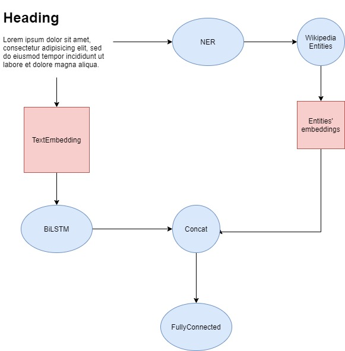

# GRAPH ENTITY LINKING SUMMARIZATION

###### 1) Entity Linking architecture

###### 2) Commands (training + testing)

- To execute NER model 

` python -m models.NER_model ` 

- To execute EL model 

`python -m models.EL_model`

